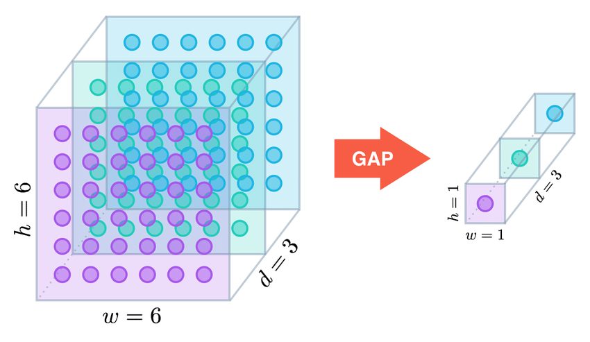
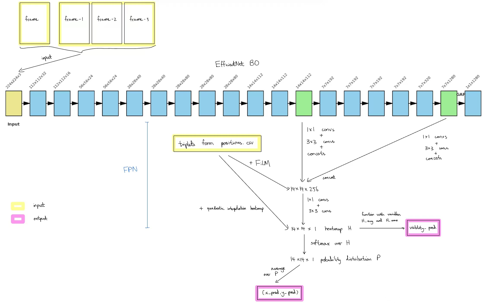

# 4. Modeling Journey

In this section, we summarize of the motivations, implementations and problems for each of the 11 versioned 
models. We can treat each model as a jigsaw puzzle to slot into the inference pipeline, as models 
for the same stage share the same input and output signatures.

---

<a id="stage-1-version-table-optional-reading"></a>

??? note "Stage-1 version table (optional reading)"

    | Version + Implementation order | Significant changes made                                                                                                                                                                                                                                                                                                                                                                                              | Improvements | Problems |
    |-------------------------------|-----------------------------------------------------------------------------------------------------------------------------------------------------------------------------------------------------------------------------------------------------------------------------------------------------------------------------------------------------------------------------------------------------------------------|--------------|----------|
    | 1, 1                          | - Runs an MLP on a vector [backbone_GAPs, trajectory_vector] for prediction.<br>- Uses an MLP-based attention mechanism to assign a weight to each past frame.<br>- Uses a sequence of 1D convolutions to encode 30 past triplets into a trajectory vector.<br>- Uses EfficientNet B3 as backbone.<br>- L2 distance loss function with a margin parameter to prevent overfitting. | N/A | - Overfit to the dataset, poor performance with unseen footage.<br>- Slow learning during training. |
    | 2, 2                          | - Changed prediction MLP structure from stage 1.                                                                                                                                                                                                                                                                                                                                                                      | - Slightly faster learning | - Same as version 1 |
    | 3, 3                          | - Instead of outputting one prediction, version 3 outputs three.<br>- Implemented a `diversity_loss` function which penalized three outputs for being too close to each other. This encouraged the model to make three far apart predictions such that at least one is very good.                                                                                                                                     | - None, the three predictions always formed dense clusters. However, this led to the elegant solution of using the vertices of an equilateral triangle as points to zoom in on. | - Essentially reproduced the results of version 2, but 3 times. |
    | 4, 11                         | - First stage-1 adoption of the heatmap paradigm instead of the global average pooling (GAP) → MLP approach used before.<br>- Instead of using 30 past triplets, version 4 uses only the last one.<br>- Uses EfficientNetV2 B3 as backbone.<br>- Uses layers of backbone → BiFPN → heatmap logit approach.                                                                                                            | - Extremely fast learning rate. Achieved the same training loss as version 2 (110 epochs) in just 25 epochs.<br>- Much better performance on unseen footage.<br>- Faster inference due to EfficientNetV2 being more GPU-optimal. | - Struggles to adapt to footage taken from angles not encountered in training. |

<a id="stage-2-version-table-optional-reading"></a>

??? note "Stage-2 version table (optional reading)"

    | Version + Implementation order | Significant changes made | Improvements | Problems                                                                                                                                                                                     |
    |--------------------------------|--------------------------|--------------|----------------------------------------------------------------------------------------------------------------------------------------------------------------------------------------------|
    | 1, 4 | - Runs an MLP on a vector [backbone_GAPs, trajectory_vector] for prediction.<br>- Uses an MLP-based attention mechanism to assign a weight to each past frame.<br>- Uses a sequence of 1D convolutions to encode 30 past triplets into a trajectory vector.<br>- Uses EfficientNet B0 as backbone.<br>- L2 distance with a margin parameter and MSE loss functions for xy and visibility predictions respectively.<br>- Differential learning rates for the backbone and everything else. | N/A | - Slow learning rate. After 100 epochs, the training distance loss was at 0.02 with respect to the crop.<br>- Validation losses stayed near 0.10, five times higher than the training losses. |
    | 2, 5 | - Instead of taking 30 past triplets and using 1D convolutions to encode into a trajectory vector, we use only 6 and pass them in raw form with 5 deltas in between.| - None observed. In particular, validation losses remained high. | - Same as version 1                                                                                                                                                                          |
    | 3, 6 | - Instead of having a single MLP run on the [backbone_GAPs, trajectory_vector] to produce (x_pred, y_pred, visibility_pred), we truncate the MLP in the middle, and apply two prediction heads; one for (x_pred, y_pred) and the other for visibility_pred. <br>- I was recommended by ChatGPT to exclude bias terms and normalization parameters from weight decay in order for validation losses to drop. | - Frustratingly, none observed. Validation losses remained high.| - Same as versions 1 and 2                                                                                                                                                                   |
    | 4, 7 | - The first adoption of the heatmap paradigm for any version instead of the GAP → MLP approach used before.<br>- Used stage 5 of the backbone architecture with shape [112, 14, 14] and stage 9 with shape [1280, 7, 7] in a single FPN run.<br>- Implemented the interpolation physics model in its full form.<br>- Implemented a FiLM (feature-wise linear modulation) from the 6 past triplets and 5 deltas to apply an affine transformation uniformly on all intermediate heatmap logits.<br>- Implemented a linear visibility predictor based on the mean and max of the heatmap logits. | - Training losses (distance + visibility) dropped below 0.02 with respect to the crop in 20 epochs and stabilized at 0.011 after 100 epochs.<br>- Thus, we know that the heatmap paradigm will at least give asymptotically better predictions. | - Validation losses stayed near 0.20; even higher than the previous stages due to the paradigm shift from MLP to heatmap.                                                                    |
    | 5, 8 | - Technically, nothing changed regarding the model, as the key change was at the dataset stage where I changed the way Gaussian noise was applied to the crops.<br>- Instead of applying 0.01 * random noise in the shape of the crop and adding it on, I added a random scalar taken uniformly from 0–0.02 * random noise in the same shape. | - Immediately, the validation losses began to agree with the training losses.<br>- After 260 epochs, the combined training and validation losses stabilized at 0.0069 and 0.0081 respectively. | - Visibility prediction was observed to be poor with unseen footage.                                                                                                                         |
    | 6, 9 | - Used EfficientNetv2 B0 as backbone.<br>- Used 4 iterations of BiFPN on 4 stages of the backbone architecture, in contrast to 1 iteration before on only 2 stages.<br>- Removed the interpolation physics model and FiLM as I only wanted to use version 6 as a proof of concept for BiFPN.<br>- Removed visibility prediction entirely as I only wanted to use version 6 as a support model for version 4/5, which doesn’t need a visibility predictor.<br>- Applied crop normalization as is recommended for EfficientNetv2 models by ChatGPT. | - Surprisingly none. | - Training losses and validation losses never went below 0.013.<br>- Much slower learning rate than I expected, especially compared to stage-1 version 4.                                    |
    | 7, 10 | - Added the interpolation physics model back in. | - In 100 epochs, the validation losses stabilized at 0.011. | - In terms of distance loss, version 7 is still quite far off versions 4/5.                                                                                                                  |

---

## Particularly important versions

### Stage-1 v1

**Model summary: GAP -> MLP regression head**

This is the first model I designed for the project. Having finished a much simpler regression project before with an 
MLP head, I thought feeding a vector into another MLP was a sound strategy. For this approach to work, we need a 
feature extractor, which in this case is the last stage of the EfficientNet B3 architecture which applies GAP to 
produce a tensor of shape [1536, 1, 1].

1. We pass the downsampled current frame into the feature extractor to get a vector 
of dimension 1536. 
2. We do the same to the downsampled past frames and 
apply an attention mechanism to get another vector of dimension 1536. 
3. We use a sequence of 1D 
convolutions on the 30 past triplets to produce a "physics" vector of dimension 64. 
4. Fused together, we have a vector of dimension 
3136, which we pass to an MLP of depth 4 to produce (x_rough, y_rough).

**Why the model failed**

In one word: GAP. We use Figure 5 to illustrate why GAP is so detrimental to high-precision point estimation tasks.

<figure markdown>
  { width="80%" }
  <figcaption>Figure 5: Effects of GAP</figcaption>
</figure>

Suppose we pass an image to a CNN. Before the final GAP operation, the image is typically represented as a feature map 
of rank 3 (conceptually a cuboid where you need three indices to access any entry). 

The width and height of the feature 
map split the image into a grid, while the depth represents how many features you store for each cell. 
In Figure 5, we split the image into a 6x6 grid, and store 3 features for each of the 36 cells. 

What we have in a feature map of rank 3 is rich spatial information; the depth tells you what kind of feature exists while 
the width and height tell you where you can find that feature.

GAP averages the 36 features in each sheet and collapses the rank-3 feature map rich with spatial information into one which 
effectively has rank 1 (a vector). 

The new feature map only tells you roughly what exists in the image, with no information 
regarding where. Clearly, feeding any MLP with this new feature map for point-estimation won't work as the MLP 
cannot reconstruct spatial information from an average, leading to the severe overfitting and slow learning rate we 
observed.

--- 

### Stage-1 v4

**Model summary: BiFPN -> heatmap**

Having seen the effectiveness of FPN/BiFPN → heatmap approaches in the later stage-2 versions, I kept the design of 
stage-1 version 4 extremely simple. 

We take 4 stages from the EfficientNetv2 B3 architecture, with the earlier stages 
capturing low-level features such as lines and the later stages capturing high-level semantic features such as feathers. 

We fuse 
these stages and apply a sequence 
of 1x1 and 3x3 convolutions to get a heatmap with shape [75, 75, 1]. We then add small peak where the 
xy-coordinates of the last triplet were, make the resulting heatmap a probability distribution, take a mean over the distribution, and that’s 
it.

Conceptually, stage-1 version 4 is very vanilla; it doesn’t need more complexity as stage 1 only needs to produce a 
rough prediction within 0.06 normalized units away from the ground truth.

---

### Stage-2 v4 + v5

**Model summary: FPN -> heatmap**

<figure markdown>
  { width="80%" }
  <figcaption>Figure 6: Stage-2 v4 + v5 model diagram</figcaption>
</figure>

This is the first model that uses the heatmap approach for prediction. Figure 6 summarizes the model; for a deeper dive, I would recommend reading [stage2_model_v4.py](https://github.com/BillTheTsar/Shuttle-Detection/blob/main/scripts/stage2_v4/stage2_model_v4.py). I think there is more
nuance in exploring how the validation losses dropped in version 5 with a one-liner change.

**How did the validation losses drop?**

For a whole week, the validation losses across four different stage-2 versions could not drop below 0.10 while the 
training losses reliably hit 0.012. This led to much frustration, from which I conducted
debugs on the dataset, dataloader, models and even training procedures; to no avail.

As last resort, I ran 6 tests to see the impacts of different combinations of data augmentation techniques on the 
losses incurred. The data is presented in the following table:

| Test no. | Data split | Color jitter applied | Gaussian noise | Horizontal flip applied | Average loss |
|----------|------------|-----------------------|----------------|-------------------------|--------------|
| 1        | Training   | False                 | 0.00           | False                   | 0.1651       |
| 2        | Training   | True                  | 0.01           | True                    | 0.0089       |
| 3        | Validation | False                 | 0.01           | True                    | 0.0108       |
| 4        | Testing    | True                  | 0.01           | True                    | 0.0081       |
| 5        | Validation | False                 | 0.01           | False                   | 0.0108       |
| 6        | Validation | True                  | 0.00           | True                    | 0.2017       |

We see the average losses cluster around 0.01 and 0.20. We also see that there is a perfect 
correlation between applying Gaussian noise and incurring an abnormally high validation loss. Before stage-2 version 5, 
we would apply Gaussian noise to a crop or frame the following way:

```python
# dataset.py
def apply_noise(frames, noise_std=0.01):
    """
    Apply different Gaussian noise per frame.
    Takes in a list of images and returns a list of tensors.
    """
    noisy_frames = []
    for img in frames:
        img_tensor = transforms.ToTensor()(img)
        # noise_std = np.random.uniform(low=0, high=noise_std) # from version 5 onwards
        noise = torch.randn_like(img_tensor) * noise_std # noise_std is a constant
        img_tensor = torch.clamp(img_tensor + noise, 0, 1)
        noisy_frames.append(img_tensor)
    return noisy_frames
```

We use an analogy to explain why training with a constant `noise_std` and then performing inference without it 
(data augmentation is not used in inference) is problematic. 

Imagine the model as a racehorse and the training images as its racetrack. During training, every track the horse runs 
on is covered with rainwater; sometimes shallow, sometimes deeper, but averaging 0.01 meters in depth. Over hundreds of 
training sessions (epochs), the horse becomes highly specialized for these tracks: adjusting its gait and optimizing for traction on wet ground.

On race day, the horse is released onto a perfectly dry concrete track. Though still fast, the horse's 
fine-tuned instincts don't fit well to the new environment. It underperforms due to a 
shift in conditions it was never trained for.

Leaving the story behind, we can uncomment out the following line, which effectively trains our racehorse in all 
conditions so that it is not "surprised" by any.

```python
noise_std = np.random.uniform(low=0, high=noise_std) # from version 5 onwards
```

Within the first epoch of training, the validation losses dropped to 0.04; a bottleneck solved by one line.

<br><br>