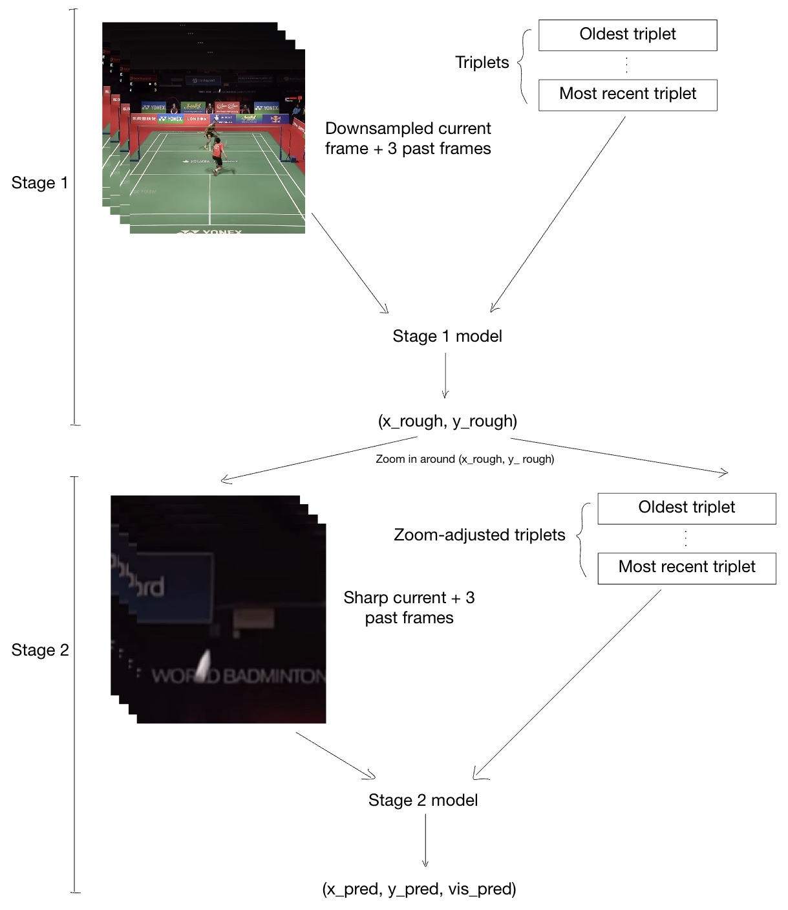
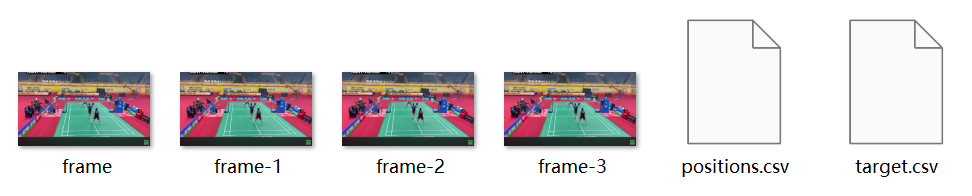
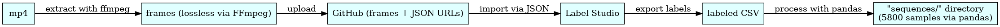
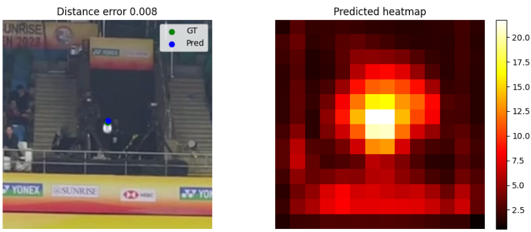
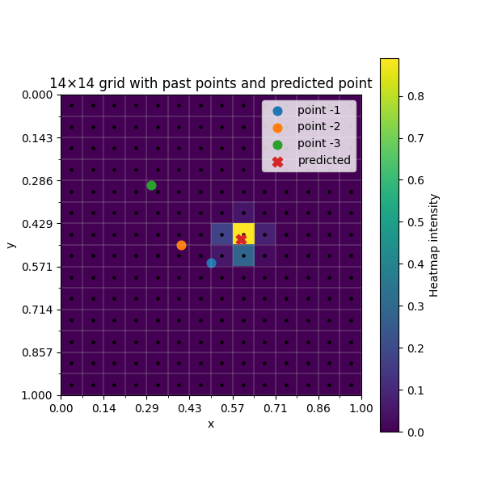

# Predicting Shuttle Landing Positions from Video Frames
*A machine learning project by Bill Zhang*

---

## Abstract

> This report fleshes out a two-stage computer vision system capable of localizing the position of a badminton shuttle in 
> video footage, frame by frame. Over two months, I developed 11 model versions which incorporate contextual motion 
> modeling and heatmap-based inference. The final system achieves real-time inference speeds (86 FPS) and 
> sub-pixel precision on standard 1080p footage, with practical applications in sports analytics and even shot 
> anticipation.

---

## Table of Contents
- [1. Introduction](#1-introduction)
- [2. Project Overview](#2-project-overview)
- [3. Technical Design](#3-technical-design)
- [4. Model Development Log](#4-model-development-log)
- [5. Results](#5-results)

---

# 1. Introduction

## Problem statement

**Given a video of a badminton game, identify the precise position of the badminton shuttle head in all frames in which it is present and in play.** 

This task is deceptively simple and yet rich with challenges that make it both an academically and practically worthwhile problem:

- **Miniscule object size:** Badminton shuttles are extremely small, occupying roughly 1/30 of both the width and height
    of the frame (roughly 0.11% of the total frame area). The shuttle head is a small part of an already tiny object, 
    making it extraordinarily difficult to localize with precision.
- **Complex object shape:** Badminton shuttles exhibit a wide variety of silhouettes and patterns depending on the 
  viewing angle. This is in contrast to most ball sports, where the silhouette of the “ball” is a circle, lending easily
  to traditional convolutional filters.
- **High speed and occlusion:** Upon impact, badminton shuttles, albeit for a split second, become the fastest objects 
  among all ball sports. There is significant blur and occlusion due to the racket, making precise positional 
  predictions very challenging.


### Motivations

Whether we want to analyze the shot selection of professionals, anticipate the shot played a split second before impact,
or provide an alternative to the Hawkeye technology, determining the precise position of the shuttle head is the 
necessary foundation for any high-level automation task. Also, it is a fun project that I thought would be 
computationally feasible and highly rewarding with a reasonable development time of 1-2 months.

---

### Assumptions and definitions

- We use only the frames of a 1920x1080 resolution video from as input.
- The frame rate of the video is at least 30 FPS, with no theoretical upper limit, though much beyond 60 FPS is impractical.
- A shuttle is in play from the moment it leaves the player’s hand during serves and stops being in play when it stops 
  moving on the ground (not when it lands).
- We use present interchangeably with visible. Thus, a shuttle head is present if and only if it is not fully occluded 
  (occlusion by the racket does not qualify as fully occluded, as it is partial) and in the frame.


### Ideal result

A model which can perfectly predict whether a shuttle is in play and present. If it is, return (x_pred, y_pred, 1) 
where x_pred and y_pred are the normalized coordinates in [0, 1] x [0, 1]. Otherwise, return (0, 0, 0) for that frame 
(the last entry represents visibility). Furthermore, the model should be fast enough to achieve real-time inference 
on consumer GPUs, which we define to be 60 FPS.


### Extensions considered

- **Shot prediction:** I originally wanted to predict the shot a player makes moments before impact. Such a prediction 
   model would require not only video data, but features such as the shuttle head position, racket orientation and pose 
   estimation of the players. I soon realized that the time required for such a project would be infeasible. Worse, the 
   existence of such a model is not guaranteed; if the best players in the world are frequently fooled by deceptions, 
   what chances does a model trained by an undergraduate student have?
- **Commentary:** Combined with a bounding box + multi-object tracking model for the players, the ideal-result model 
   could comment on the game, offering simple remarks such as “player 1 hit a cross-court drop from the back-court left 
   corner” and “player 3 played a winning smash straight down the line”.

---
<br>

# 2. Project Overview

## Key information

- **Duration:** 2 months, 13/07/2025 - 12/09/2025
- **Project type:** independent research and development
- **Domain:** supervised learning in computer vision
- **Primary language:** Python

## Achievements

- **Independently executed the full ML development cycle**, from data creation (5800 labeled samples), preprocessing 
  and model architecture design to training, iterative redesigns (11 versioned models), and deployment using TensorRT.
- **Compiled a custom-labeled dataset of 5800 frames**, where final-stage predictions deviated by only 3-4 pixels on 
  average from the manually labeled shuttle head positions; an impressive level of precision given the object’s small 
  size and extreme speed.
- **Built a two-stage computer vision system that competently solves the shuttle localization task** proposed in the 
  problem statement. The system achieves real-time inference at 86 FPS, comfortably surpassing the 60 FPS requirement 
  for live video processing.
- **Delivered an inference engine running on consumer-grade GPUs** using `.engine` model exports. The optimized 
  deployment pipeline reduces startup latency from 9 to <1 seconds and doubles throughput with layer fusion and FP16 
  precision.
---

## Tools used and learned during the project

### Deep learning and model deployment
- **PyTorch** (learned): for implementing multiple model architecture designs, model training scripts and deployment 
  (though inference using TensorRT engine exports is 2.5 times faster).
- **ONNX and TensorRT** (learned): for accelerated deployment by exporting .pth model weight files to .onnx and .engine 
  files respectively. With layer fusion and mixed precision (almost all in fp16), inference jumped from 42 FPS to 86 
  FPS on average.
- **EfficientNet B0, EfficientNetv2 B0 and B3** (learned): these formed the CNN backbones of both stages, from which 
  FPN and BiFPN techniques were applied on layers of varying strides to produce heat maps. These were chosen for their 
  light parameter counts and low FLOPs compared to ResNet and YOLO-based methods.

### Data infrastructure and training
- **Paperspace Gradient** (learned): a cloud-based workflow for executing model training on rented A4000 GPU in the 
  Notebooks environment with persistent storage before acquiring a laptop with RTX 5080 GPU.
- **Label Studio** (learned): for importing raw data hosted on GitHub, facilitating hand-labeling and exporting the 
  labeled samples into a csv file for downstream cleaning.
- **Hugging Face** (learned): for hosting the entire processed dataset to be imported into the Paperspace Gradient 
  notebook (direct uploading, even zipped, was impossible).

### Data processing and visualization
- **TensorBoard** (learned): for visualizing training and validation losses during training, identifying model 
  overfitting and monitoring parameters of interest.
- **Pandas, numpy and matplotlib** (used): pandas was used for data cleaning, converting the csv files exported from 
  Label Studio to the processed dataset directly used for model training. numpy and matplotlib were used for verifying 
  the correctness of data augmentation techniques, visualizing model heatmap outputs and prototype adjustments.

---

## Skills picked up during the project

- **End-to-end pipeline design of a two-stage system**, incorporating modular training, hard example mining for stage 2 
  and a tailored method of integrating the two stages for stable inference.
- **Iterative model redesigns** based on TensorBoard log patterns and inference stability. From developing 11 versioned 
  models, I have seen improvements from complete paradigm shifts e.g. switching from MLP on global average pooling to 
  heatmap-based inference to subtle yet impactful changes e.g. adjusting Gaussian noise magnitudes.
- **Tensor manipulation up to rank 5**, including reshaping, broadcasting, bit-masking, and squeezing.
- **Using Label Studio to manually annotate 5800 video frames** with shuttle head positions, then using pandas with 
  anomaly handling to produce training-ready datasets.
- **Learned to export PyTorch state dict models to ONNX, and then to TensorRT .engine files** with optimized 
  performance settings and batch-size flexibility during inference.
- **Learned to adapt training for Paperspace Gradient** with its CLI-based model versioning and environment setup under 
  compute and memory restraints.

---

<br>

# 3. Technical Design

## Pipeline overview

In spite of having 11 versioned models (4 for stage 1, 7 for stage 2) with different
architectures, the general pipeline since the inception of this project has remained constant. 

Rather than presenting 
the pipeline as a fixed sequence, I describe the underlying challenges it was designed to solve. The pipeline’s 
structure will fall out naturally as a response to these problems.

---

### Problem 1: high-resolution requirements under real-time constraints

Most popular CNNs like ResNet, AlexNet, YOLOv8 and EfficientNet are capped off at an input resolution of 600x600, 
which is nowhere near the resolution we need (1920x1080). As we have stated, badminton shuttles typically occupy a 
height and width 1/30 of the frame, and thus become a blurred blob with any significant downsampling.

On top of this, we want to achieve inference speeds above 60 FPS, and 
since FLOPs scale quadratically with resolution, resolutions above 360x360 are not seriously considered. 

On the one hand, we need high resolution to pinpoint the shuttle head, but low resolution to meet runtime constraints.

**Impact on pipeline:**

This is only a problem if we insist on solving the problem statement with one CNN pass per frame. Thus, we must 
look to a multi-stage pipeline. Here, we are lucky because while locating the precise position of a 
shuttle head at low resolution is impossible (for someone with 10+ years of experience), finding the approximate region 
of the shuttle is not. Conceptually, we could look for a white blob or infer from the players’ movements.

Thus, we split the inference into two stages; stage 1 for locating the approximate region of the shuttle using frames 
downsampled to low resolution, and stage 2 for precisely locating the shuttle head once we zoom in around the rough 
prediction (by zooming in, we mean taking a low-resolution but sharp crop around the stage 1 prediction). We thus have 
a course-to-fine point estimation pipeline.

This coarse-to-fine pipeline not only satisfies our resolution-FPS requirements but also decouples training, with each 
stage having its own loss functions, optimizers etc. It also allows us to intelligently combine models from the two 
stages later to increase inference stability (discussed under Modes of inference).

---

### Problem 2: the need for context

While I was labeling shuttle heads, I would often find them too blurry to localize based on one frame alone. In those 
cases, I would roll back a few frames, find one in which the shuttle was clearer, and infer from the “good” frame where 
the shuttle head in the current frame should be. Since shuttle heads follow a smooth 
trajectory outside of being hit and do not change orientation much between frames, we can accurately infer from 
past data.

**Impact on pipeline:**

Both stages are fed the current frame, 3 prior frames and a sequence of triplets with structure 
(x, y, visibility) from the immediate past. For convention, these temporal inputs are ordered oldest to most recent. 

Together, this gives a context-enriched, coarse-to-fine pipeline that leverage the task's physical properties I learned 
while labeling. Figure 1 illustrates the inference pipeline.

<figure style="text-align: center;">
  
  <figcaption>Figure 1: Conceptual diagram of the inference pipeline</figcaption>
</figure>

---

## Dataset overview

To build a training set that reflects real-world gameplay, I collected footage from four 1920×1080, 60 FPS badminton 
videos: three were Creative Commons–licensed from YouTube, and one was personally recorded. My mum and I manually 
annotated 5,800 samples. After shuffling, 90% of samples were labeled as training, 5% were labeled validation and 
testing each. The structure of each sample is given in Figure 2.

<figure style="text-align: center;">
  
  <figcaption>Figure 2: Structure of each sample in the dataset</figcaption>
</figure>

frame is the current frame, the other three are the 3 past frames, with frame-1 being the most recent. positions.csv 
contains 30 past triplets, with (x_truth, y_truth, 1) if the shuttle head is present in its corresponding frame and 
(0, 0, 0) otherwise. Lastly, target.csv records the ground truth triplet for the current frame and is used in all loss 
functions. Figure 3 gives a conceptual overview of the process from raw mp4 to the samples.

<figure style="text-align: center;">
  
  <figcaption>Figure 3: process from mp4 -> samples</figcaption>
</figure>

---

### Data augmentation

To maximize robustness across lighting conditions, noise profiles, and camera angles, I implemented a selected set of 
augmentation techniques, ensuring realism was preserved while still enabling generalization.

**1. Uniform color jitter across frames**

Enhances the models' adaptability to various lighting conditions by changing brightness, contrast, saturation, 
and hue uniform across the 4-frame context.

```python
# dataset.py
self.color_jitter = torchvision.transforms.ColorJitter(
    brightness=0.3, contrast=0.2,
    saturation=0.2, hue=0.05
)
```

**2. Independent Gaussian noise per frame**

Prevents overfitting to low-level pixel patterns and encourages focus on higher-level motion and shapes.

```python
# dataset.py
def apply_noise(frames, noise_std=0.01):
    """
    Apply different Gaussian noise per frame.
    Takes in a list of images and returns a list of tensors.
    """
    noisy_frames = []
    for img in frames:
        img_tensor = transforms.ToTensor()(img)
        noise_std = np.random.uniform(low=0, high=noise_std)
        noise = torch.randn_like(img_tensor) * noise_std
        img_tensor = torch.clamp(img_tensor + noise, 0, 1)
        noisy_frames.append(img_tensor)
    return noisy_frames
```

**3. Horizontal flipping with positional adjustment**

Simulates mirrored camera angles with appropriate x-coordinate inversions.

```python
# dataset.py
if self.apply_flip and random.random() < 0.5:
    current_tensor = torch.flip(current_tensor, dims=[2])
    past_tensor = torch.flip(past_tensor, dims=[3])
    positions_tensor[:, 0] = 1.0 - positions_tensor[:, 0]
    target_tensor[0] = 1.0 - target_tensor[0]
```

**4. Triplet Perturbation**

Perturbs past (x, y) triplets slightly to discourage over-reliance on historical positional certainty, since inference
would not be as perfect.

```python
# dataset.py
def perturb_positions(positions, max_perturb=0.02):
    """
    Perturbs visible (x, y) positions in a list or NumPy array.
    Args:
        positions: list of [x, y, vis] or NumPy array of shape [T, 3]
        max_perturb: max change in normalized coords (±)
    Returns:
        np.ndarray of shape [T, 3] with perturbed positions
    """
    positions = np.array(positions, dtype=np.float32).copy()
    for i in range(len(positions)):
        x, y, vis = positions[i]
        if vis >= 0.5:
            dx = np.random.uniform(-max_perturb, max_perturb)
            dy = np.random.uniform(-max_perturb, max_perturb)
            new_x = np.clip(x + dx, 0.0, 1.0)
            new_y = np.clip(y + dy, 0.0, 1.0)
            positions[i][0] = new_x
            positions[i][1] = new_y
            # visibility stays unchanged

    return positions
```

**Reflections on Data Design Choices**

Some transformations such as affine warps and perspective distortions were intentionally excluded to preserve physical 
realism. However, in hindsight, random rescaling would have added resilience to changes in video scale, something the 
current models remain sensitive to (see [Limitations](#limitations)).

---

## Key design decisions

**Stage-1 CNN backbones:** stage-1 models used either EfficientNet B3 or EfficientNetv2 B3 as their CNN backbones. 
The input size for both is 300 x 300, hence we must downsample all 4 frames before extracting feature maps. 
I picked the B3 version for both as it strikes a good balance between input resolution and FLOPs.

**Stage-2 CNN backbones:** stage 2 uses either EfficientNet B0 or EfficientNetV2 B0, both with input dimensions of 
224×224. This defines the precise crop size taken from the original frame, centered around the Stage 1 estimate.

B0 was chosen for its very low FLOPs, aligning with our goal of high FPS inference. However, the small crop size means 
the tolerance for stage-1 error is limited; only ±112 pixels in each direction. This makes accurate coarse localization 
in stage 1 especially critical.

**Heatmap paradigm:** In later versions of both stages (see [Model Development Log](#4-model-development-log)), all models use heatmap-based 
localization rather than regressing coordinates directly with an MLP.

<figure style="text-align: center;">
  
  <figcaption>Figure 4: Demonstration of the heatmap approach</figcaption>
</figure>

On the left of Figure 4, we have a sharp crop of the current frame fed into a trained stage-2 model. The model slices 
the crop into a 14 x 14 grid. 

For each cell in the grid, the model looks at that cell in the current and past 
3 crops and outputs a single real number representing how likely it thinks that cell contains the shuttle head. 
Applying softmax gives a probability distribution, which we average to get a prediction, which in this case is very close 
to the ground truth (GT). 

**Interpolation physics model:**  for stage 2, past triplets contribute to the overall heatmap through a simple 
interpolation model: take 3 triplets in the past and perform a quadratic interpolation on the xy-coordinates to predict 
the xy-coordinates of the current triplet.

As shown in Figure 5, this generates a heatmap of its own, which we can add 
to the CNN-heatmap to influence the final prediction. A quadratic interpolation was picked as it is robust to 
overfitting and can be expressed neatly in closed form, given below.

```python
# auxiliary_heatmap.py
x_pred = x_1 - 3*x_2 + 3*x_3 #  x_1 represents the x-coordinate of the last triplet
y_pred = y_1 - 3*y_2 + 3*y_3
```

<figure style="text-align: center;">
  
  <figcaption>Figure 5: Example of heatmap generated by quadratic interpolation on 3 points</figcaption>
</figure>

---

## Modes of inference

This subsection should belong under _Key design decisions_, but is promoted to section status due to its complexity.

At inference time, we choose between two distinct single-frame inference steps, each offering different trade-offs 
between accuracy and computational cost.

---

**Calibration step** closely resembles the inference pipeline described in Figure 1, with two key modifications:

- We employ an ensemble of two stage-2 models (a main model and a supporting model) to jointly predict the shuttle 
  head’s visibility. This ensemble approach improves visibility prediction accuracy at the cost of 
  doubling stage-2 compute. However, visibility prediction remains challenging and is prioritized for further updates.
- Instead of zooming in directly on the rough estimate (x_rough, y_rough), we construct an equilateral triangle of 
  circumradius 0.06 centered at that point and apply zooming at its three vertices. This strategy increases the stage-2 
  catchment area substantially, though it triples the computational cost.

As a result, we obtain six prediction triplets from stage 2: three spatial zooms from the triangle, each processed by 
two models. We then select the pair with the highest visibility score, and use the 
triplet predicted by the main stage-2 model as the final output.

In summary, running a calibration step on a frame invokes 4 passes through B3 (current + 3 past) and 24 passes through 
B0, taking roughly 20 GFLOPs including other non-backbone procedures. Its large catchment area with heavy computational 
cost gives it the name calibration.

**Fast step** bypasses both stage-1 and triangle construction, zooming in directly on the coordinates predicted 
in the previous frame. If the previous triplet is (0, 0, 0), we skip the current frame entirely and return (0, 0, 0). 

Skipping stage 1 is justified since the shuttle head typically remains visible in the crop centered around its prior 
position. For visibility prediction, fast step still uses two stage-2 models for ensemble voting.

In summary, running a fast step on a frame invokes only 8 passes through B0, taking roughly 4 GFLOPs; this is 
significantly cheaper than the calibration step, hence its name.

---

Modes of inference answer the question “which step should we use for the current frame”? We introduce 
**calibration mode**, **fast mode** and **smart mode**.

### Calibration mode

Runs a calibration step every single frame. Very slow and surprisingly unstable (the predictions tend to jump around); 
serves more as a benchmark than a practical inference method.

### Fast mode

Runs a calibration step once every `self.fast_calib_interval` frames, where `self.fast_calib_interval` is configurable. Every other frame is processed with fast steps. This mode produces more stable predictions than calibration mode, and is naturally much faster.

```python
# engine.py
elif self.mode == "fast":
    # Calibrate every K frames regardless
    if (self._t % self.fast_calib_interval) == 0:
        gx, gy, gv = self._calibration_step(cur_full, pos30)
        self._roll_past(cur_full)
        self._t += 1
        return gx, gy, gv, False
    else:
        # Use last if visible; else calibration
        if int(positions_deque[-1][2]) == 1:
            last_xy = (float(positions_deque[-1][0]), float(positions_deque[-1][1]))
            gx, gy, gv = self._fast_step(last_xy, cur_full, pos30)
        else:
            gx, gy, gv = (0, 0, 0)
```

---

### Smart mode

The smart mode of inference was developed around the philosophy of running calibration steps only when we detect 
pathological behaviors. Below, we outline the problems smart mode is designed to detect, the triggers for each, 
and the corresponding mitigation strategies.

**Problem 1: false negatives from missed shuttle visibility**

One problem with fast mode is that if any step predicts “invisible shuttle head”, we would have a sequence of 
“invisible shuttle head” predictions until the next calibration step. In the worst case, we must wait 
`self.fast_calib_interval` frames before the next calibration; potentially a lot of false negatives.

**Solution 1A: detect newly invisible predictions**

If the previous prediction was visible, but the current fast prediction is invisible, smart mode triggers a calibration 
step to verify whether the shuttle head is truly missing.

```python
# engine.py
p3x, p3y, p3v = self._fast_step(last_xy, cur_full, pos30)
last_two = self._last_two(positions_deque)
# if last_two is not None:
(x1, y1, v1), (x2, y2, v2) = last_two  # p1, p2
v1 = int(v1); v2 = int(v2)
# trigger 4: p2 (last prediction) visible but p3 invisible
if v2 == 1 and p3v == 0:
    self.freshly_invisible += 1
    gx, gy, gv = self._calibration_step(cur_full, pos30)
```

**Solution 1B: cap the maximum consecutive invisibility tolerated**

On top of this, we define `self.inv_len` as the number of consecutive “invisible shuttle head” predictions tolerated 
before triggering a calibration step.

```python
# engine.py
# (1) N consecutive invisibles?
if self._last_n_invisible(positions_deque, self.inv_len) \
    and (self._t - self._last_n_invisible_trigger_frame) >= self.inv_len:
    gx, gy, gv = self._calibration_step(cur_full, pos30)
    self._last_n_invisible_trigger_frame = self._t
```

The logic above also ensures that if, for example, `self.inv_len = 8`, the calibration check is performed at most once 
every 8 frames—even if the consecutive invisible condition continues to be met. Without this safeguard, the system 
would naïvely re-check every subsequent frame after the 8th, leading to redundant calibration attempts.

---

**Problem 2: false positives from background artifacts**

Due to visibility prediction being particularly challenging, it is frequently the case in both calibration and fast 
modes that we get a sequence of “visible shuttle head” predictions in the background or over players’ shirts. 
In egregious cases, the false positive predictions flit across the screen at a speed impossible for real shuttle heads.

**Solution 2A: large angular deviations**

It was observed that these false positives do not follow a smooth trajectory and are characterized by large angles 
between consecutive predictions. Thus, we define a configurable variable `self.angle_thresh` such that if the coordinates 
of three consecutive visible predictions form an angle larger than `self.angle_thresh`, then we trigger a calibration 
step.

**Solution 2B: large positional jumps**

Similarly, if the Euclidean distance between the last prediction and the current fast prediction exceeds `jump_thresh`, 
we trigger a calibration step.

```python
# engine.py
p3x, p3y, p3v = self._fast_step(last_xy, cur_full, pos30)
last_two = self._last_two(positions_deque)
# if last_two is not None:
(x1, y1, v1), (x2, y2, v2) = last_two  # p1, p2
v1 = int(v1); v2 = int(v2)

if v2 == 1 and p3v == 1:
    d2 = np.array([p3x - x2, p3y - y2], dtype=np.float32)
    # trigger 3: jump too large
    jump = float(np.linalg.norm(d2))
    if jump >= self.jump_thresh:
        self.big_jump += 1
        gx, gy, gv = self._calibration_step(cur_full, pos30)
        return gx, gy, gv, True
    # triggers 2 when p1 and p2 are visible, and we got a visible p3
    if v1 == 1:
        d1 = np.array([x2 - x1, y2 - y1], dtype=np.float32)
        # trigger 2: angle between d1 and d2 too large
        ang = self._angle_between(d1, d2)
        if ang >= self.angle_thresh:
            self.big_angle += 1
            gx, gy, gv = self._calibration_step(cur_full, pos30)
            return gx, gy, gv, True
```

---

**Problem 3: frequent calibration triggers indicate model uncertainty**

So far, if we detect unstable behavior during a fast step, we 
would replace the fast step prediction with one from calibration step. However, calibration step is not error-proof 
and during inference, we have no way of knowing if the prediction returned from the calibration step is correct.

**Solution 3: penalize frequent calibrations with triplet zeroing**

A heuristic we use is that triggering a calibration step implies unstable inference. Thus, if we trigger 
calibration steps frequently during a short time window, then we can be confident that some instability is plaguing 
inference e.g. a player’s white shirt suddenly catching bright glints, giving patches that resemble shuttles. 

To 
penalize triggering many calibrations within a short time window, we define a buffer `calib_window` which records the 
number of calibrations within the last 6 frames. If at any time, that number exceeds 4, then we replace the last 6 
triplets with (0, 0, 0) to eliminate the noisy output.

```python
# video_inferencer.py
if sum(calib_window) >= 4:
    n = len(calib_window)
    for i in range(n):
        positions_deque[-(i + 1)] = [0.0, 0.0, 0]
        f, _, _, _ = out_window[-(i + 1)]
        out_window[-(i + 1)] = (f, 0.0, 0.0, 0)
    gx, gy, gv = 0.0, 0.0, 0
    calib_window.clear()
```

---

One might say that these artificial safeguards are a sign of weak models; in the case of visibility prediction, that is 
admittedly true. However, setting aside the visibility issue, the safeguards simply inform the pipeline what we know 
about shuttle physics. 

Moreover, when a human is annotating the frames in the first place, they are implicitly applying these checks e.g. 
“this blob really looks like a shuttle, but it’s miles away from where I last confidently predicted the shuttle head, 
so it’s probably just background noise”.

In practice, smart mode averages at 86 FPS and is much more stable than fast mode, making it the recommended mode of 
inference.

---

<br>

# 4. Model Development Log

In this section, we summarize of the motivations, implementations and problems for each of the 11 versioned 
models. Conceptually, we can treat each model as a jigsaw puzzle to slot into the inference pipeline, as models 
for the same stage share the same input and output signatures.

---

## Stage-1 version table (optional reading)

<details>
    <summary>Click to expand</summary>


| Version + Implementation order | Significant changes made                                                                                                                                                                                                                                                                                                                                                                                              | Improvements | Problems |
|-------------------------------|-----------------------------------------------------------------------------------------------------------------------------------------------------------------------------------------------------------------------------------------------------------------------------------------------------------------------------------------------------------------------------------------------------------------------|--------------|----------|
| 1, 1                          | - Runs an MLP on a vector [backbone_GAPs, trajectory_vector] for prediction.<br>- Uses an MLP-based attention mechanism to assign a weight to each past frame.<br>- Uses a sequence of 1D convolutions to encode 30 past triplets into a trajectory vector.<br>- Uses EfficientNet B3 as backbone.<br>- L2 distance loss function with a margin parameter to prevent overfitting. | N/A | - Overfit to the dataset, poor performance with unseen footage.<br>- Slow learning during training. |
| 2, 2                          | - Changed prediction MLP structure from stage 1.                                                                                                                                                                                                                                                                                                                                                                      | - Slightly faster learning | - Same as version 1 |
| 3, 3                          | - Instead of outputting one prediction, version 3 outputs three.<br>- Implemented a `diversity_loss` function which penalized three outputs for being too close to each other. This encouraged the model to make three far apart predictions such that at least one is very good.                                                                                                                                     | - None, the three predictions always formed dense clusters. However, this led to the elegant solution of using the vertices of an equilateral triangle as points to zoom in on. | - Essentially reproduced the results of version 2, but 3 times. |
| 4, 11                         | - First stage-1 adoption of the heatmap paradigm instead of the global average pooling (GAP) → MLP approach used before.<br>- Instead of using 30 past triplets, version 4 uses only the last one.<br>- Uses EfficientNetV2 B3 as backbone.<br>- Uses layers of backbone → BiFPN → heatmap logit approach.                                                                                                            | - Extremely fast learning rate. Achieved the same training loss as version 2 (110 epochs) in just 25 epochs.<br>- Much better performance on unseen footage.<br>- Faster inference due to EfficientNetV2 being more GPU-optimal. | - Struggles to adapt to footage taken from angles not encountered in training. |

</details>

---

## Stage-2 version table (optional reading)

<details>
    <summary>Click to expend</summary>

| Version + Implementation order | Significant changes made | Improvements | Problems                                                                                                                                                                                     |
|--------------------------------|--------------------------|--------------|----------------------------------------------------------------------------------------------------------------------------------------------------------------------------------------------|
| 1, 4 | - Runs an MLP on a vector [backbone_GAPs, trajectory_vector] for prediction.<br>- Uses an MLP-based attention mechanism to assign a weight to each past frame.<br>- Uses a sequence of 1D convolutions to encode 30 past triplets into a trajectory vector.<br>- Uses EfficientNet B0 as backbone.<br>- L2 distance with a margin parameter and MSE loss functions for xy and visibility predictions respectively.<br>- Differential learning rates for the backbone and everything else. | N/A | - Slow learning rate. After 100 epochs, the training distance loss was at 0.02 with respect to the crop.<br>- Validation losses stayed near 0.10, five times higher than the training losses. |
| 2, 5 | - Instead of taking 30 past triplets and using 1D convolutions to encode into a trajectory vector, we use only 6 and pass them in raw form with 5 deltas in between.| - None observed. In particular, validation losses remained high. | - Same as version 1                                                                                                                                                                          |
| 3, 6 | - Instead of having a single MLP run on the [backbone_GAPs, trajectory_vector] to produce (x_pred, y_pred, visibility_pred), we truncate the MLP in the middle, and apply two prediction heads; one for (x_pred, y_pred) and the other for visibility_pred. <br>- I was recommended by ChatGPT to exclude bias terms and normalization parameters from weight decay in order for validation losses to drop. | - Frustratingly, none observed. Validation losses remained high.| - Same as versions 1 and 2                                                                                                                                                                   |
| 4, 7 | - The first adoption of the heatmap paradigm for any version instead of the GAP → MLP approach used before.<br>- Used stage 5 of the backbone architecture with shape [112, 14, 14] and stage 9 with shape [1280, 7, 7] in a single FPN run.<br>- Implemented the interpolation physics model in its full form.<br>- Implemented a FiLM (feature-wise linear modulation) from the 6 past triplets and 5 deltas to apply an affine transformation uniformly on all intermediate heatmap logits.<br>- Implemented a linear visibility predictor based on the mean and max of the heatmap logits. | - Training losses (distance + visibility) dropped below 0.02 with respect to the crop in 20 epochs and stabilized at 0.011 after 100 epochs.<br>- Thus, we know that the heatmap paradigm will at least give asymptotically better predictions. | - Validation losses stayed near 0.20; even higher than the previous stages due to the paradigm shift from MLP to heatmap.                                                                    |
| 5, 8 | - Technically, nothing changed regarding the model, as the key change was at the dataset stage where I changed the way Gaussian noise was applied to the crops.<br>- Instead of applying 0.01 * random noise in the shape of the crop and adding it on, I added a random scalar taken uniformly from 0–0.02 * random noise in the same shape. | - Immediately, the validation losses began to agree with the training losses.<br>- After 260 epochs, the combined training and validation losses stabilized at 0.0069 and 0.0081 respectively. | - Visibility prediction was observed to be poor with unseen footage.                                                                                                                         |
| 6, 9 | - Used EfficientNetv2 B0 as backbone.<br>- Used 4 iterations of BiFPN on 4 stages of the backbone architecture, in contrast to 1 iteration before on only 2 stages.<br>- Removed the interpolation physics model and FiLM as I only wanted to use version 6 as a proof of concept for BiFPN.<br>- Removed visibility prediction entirely as I only wanted to use version 6 as a support model for version 4/5, which doesn’t need a visibility predictor.<br>- Applied crop normalization as is recommended for EfficientNetv2 models by ChatGPT. | - Surprisingly none. | - Training losses and validation losses never went below 0.013.<br>- Much slower learning rate than I expected, especially compared to stage-1 version 4.                                    |
| 7, 10 | - Added the interpolation physics model back in. | - In 100 epochs, the validation losses stabilized at 0.011. | - In terms of distance loss, version 7 is still quite far off versions 4/5.                                                                                                                  |

</details>

---

## Particularly important versions

### Stage-1 v1

**Model summary**

This is the first model I designed for the project. Having finished a much simpler regression project before with an 
MLP head, I thought feeding a vector into another MLP was a sound strategy. For this approach to work, we need a 
feature extractor, which in this case is the last stage of the EfficientNet B3 architecture which applies GAP to 
produce a tensor of shape [1536, 1, 1].

1. We pass the downsampled current frame into the feature extractor and squeeze the last two dimensions to get a vector 
of dimension 1536. 
2. We do the same to the downsampled past frames and 
apply a simple attention mechanism to get another vector of dimension 1536. 
3. Lastly, we use a sequence of 1D 
convolutions on the 30 past triplets to produce a vector of dimension 64. 
4. Fused together, we have a vector of dimension 
3136, which we pass to an MLP of 4 layers to produce (x_rough, y_rough).

**Why the model failed**

In one word: GAP. We use Figure 6 to illustrate why GAP is so detrimental to high-precision point estimation tasks.

<figure style="text-align: center;">
  
  <figcaption>Figure 6: Effects of GAP</figcaption>
</figure>

Suppose we pass an image to a CNN. Before the final GAP operation, the image is typically represented as a feature map 
of rank 3 (conceptually a cuboid where you need three indices to access any entry). 

The width and height of the feature 
map split the image into a grid, while the depth represents how many features you store for each square in the grid. 
In the Figure 6, we split the image into a 6x6 grid, and store 3 features for each of the 36 squares in that grid. 

What we have in a feature map of rank 3 is rich spatial information; the depth tells you what kind of feature exists while 
the width and height tell you where you can find that feature.

GAP averages the 36 features in each sheet and collapses the feature map rich with spatial information into one which 
effectively has rank 1 (a vector). 

The new feature map only tells you roughly what exists in the image, with no information 
regarding where. Clearly, feeding any MLP with this new feature map for point-estimation is a bad idea as the MLP 
cannot reconstruct spatial information from an average, leading to the severe overfitting and slow learning rate we 
observed.

--- 

### Stage-1 v4

**Model summary**

Having seen the effectiveness of FPN/BiFPN → heatmap approaches in the later stage-2 versions, I kept the design of 
stage-1 version 4 extremely simple. 

We take 4 stages from the EfficientNetv2 B3 architecture, with the earlier stages 
capturing low-level features such as lines and the later stages capturing high-level semantic features such as feathers. 

We fuse 
these stages and apply a sequence 
of 1x1 and 3x3 convolutions to get a heatmap with shape [75, 75, 1]. We then add small peak where the 
xy-coordinates of the last triplet were, make the resulting heatmap a probability distribution, take a mean over the distribution, and that’s 
it.

Conceptually, stage-1 version 4 is very vanilla; it doesn’t need more complexity as stage 1 only needs to produce a 
rough prediction within 0.06 normalized units away from the ground truth.

---

### Stage-2 v4 + v5

**Model summary**

This is the first model that uses the heatmap approach for prediction. Versions 4 and 5 in the [Stage-2 version table](#stage-2-version-table-optional-reading) offer a satisfactory 
summary of the model; for a deeper dive, I would recommend reading stage2_model_v4.py. I think there is more
nuance in exploring how the validation losses dropped in version 5 with a one-liner change.

**How did the validation losses drop?**

For a whole week, the validation losses across four different stage-2 versions could not drop below 0.10 while the 
training losses could reliably hit 0.012. This evidently led to much frustration, from which I conducted a sequence of 
debugs on the dataset, dataloader, models and even training procedures; to no avail.

As a last resort, I ran a series 
of tests to see the impacts of different combinations of data augmentation techniques on the losses incurred. 
Figure 7 shows the raw results obtained.

<figure style="text-align: center;">
  
  <figcaption>Figure 7: Raw data showing the impact of augmentation techniques on validation losses</figcaption>
</figure>

We collate this data into the following table:

| Test no. | Data split | Color jitter applied | Gaussian noise | Horizontal flip applied | Average loss |
|----------|------------|-----------------------|----------------|-------------------------|--------------|
| 1        | Training   | False                 | 0.00           | False                   | 0.1651       |
| 2        | Training   | True                  | 0.01           | True                    | 0.0089       |
| 3        | Validation | False                 | 0.01           | True                    | 0.0108       |
| 4        | Testing    | True                  | 0.01           | True                    | 0.0081       |
| 5        | Validation | False                 | 0.01           | False                   | 0.0108       |
| 6        | Validation | True                  | 0.00           | True                    | 0.2017       |

We can clearly see the average losses clustering around two values; 0.01 and 0.20. We also see that there is a perfect 
correlation between applying Gaussian noise and incurring an abnormally high validation loss. Before stage-2 version 5, 
we would apply Gaussian noise to a crop or frame the following way:

```python
# dataset.py
def apply_noise(frames, noise_std=0.01):
    """
    Apply different Gaussian noise per frame.
    Takes in a list of images and returns a list of tensors.
    """
    noisy_frames = []
    for img in frames:
        img_tensor = transforms.ToTensor()(img)
        # noise_std = np.random.uniform(low=0, high=noise_std) # from version 5 onwards
        noise = torch.randn_like(img_tensor) * noise_std # noise_std is a constant
        img_tensor = torch.clamp(img_tensor + noise, 0, 1)
        noisy_frames.append(img_tensor)
    return noisy_frames
```

We employ an analogy to explain why training with a constant noise_std and then performing inference without it 
(data augmentation is not used in inference) is problematic. 

Imagine the model as a racehorse and the training images as its racetrack. During training, every track the horse runs 
on is covered with rainwater; sometimes shallow, sometimes deeper, but averaging 0.01 meters in depth. Over hundreds of 
training sessions (epochs), the horse becomes highly specialized for these tracks: adjusting its gait and optimizing for traction on wet ground.

On race day, the horse is released onto a perfectly dry concrete track. Though still fast, the horse's 
fine-tuned instincts don't fit well to the new environment. It underperforms due to a 
shift in conditions it was never trained for.

Leaving the story behind, we can uncomment out the following line, which effectively trains our racehorse in all 
conditions so that it is not "surprised" by any.

```python
noise_std = np.random.uniform(low=0, high=noise_std) # from version 5 onwards
```

---

<br>

# 5. Results

## Quantitative results

- On average, our stage-1 v4 model can pinpoint the shuttle head’s position to within 0.01 normalized units of the 
  ground truth. To put that in perspective, if each frame were divided into a 50×50 grid, the model would correctly 
  identify the square containing the shuttle head, assuming it’s visible.
- The stage-2 v4 model, specifically the main model in our voting ensemble, refines this even further. It achieves an 
  average positional error of just 0.0081 normalized units relative to its 224×224 input crop. When mapped back to 
  the full 1920×1080 frame, this corresponds to a deviation of only 0.00168 units.

While these results reflect training performance, we expect slightly higher deviations for unseen footage. Also, we 
omit discussing visibility losses from stage 2 as the visibility predictor is very unstable and queued for immediate 
update; it would be dishonest to praise its low training losses (suspected overfitting) when this doesn’t transfer to 
inference.

---

## Qualitative results
We show 5 snippets of unseen footage labeled by our inference pipeline:

[](https://github.com/BillTheTsar/Shuttle-Detection/blob/main/labeled_videos/1.mp4?raw=true)

[](https://www.youtube.com/watch?v=XXXXXXXX)

[](https://www.youtube.com/watch?v=XXXXXXXX)

[](https://www.youtube.com/watch?v=XXXXXXXX)

[](https://www.youtube.com/watch?v=XXXXXXXX)

---

## Limitations

Below we list the main limitations of the inference pipeline with what I believe to be good solutions.

**Limitation 1:** the inference pipeline only performs well when the camera is positioned close to behind the center of the court, from where the net should be almost perfectly rectangular. Performance is particularly bad if the camera is placed near corners of the court.

**Solution to limitation 1:** all game footage the model trained on was taken from a point close to behind the center of the court. Thus, we need to enlarge our dataset by including footage taken from a variety of angles. This should not only reduce the impact of limitation 1, but also make our models more robustly sensitive to “shuttle shapes” in general.

---

**Limitation 2:** as mentioned multiple times, the visibility predictor in the stage-2 v4 model is not effective. So far, it is a affine function involving the mean and max values of the heatmap. However, the logits of the heatmap are not normalized, leading to drastically different mean and max values from similar crops.

**Solution to limitation 2:** firstly, normalize the heatmap logits to lie within [0, 1]. Apply a sequence of 1x1 and 3x3 convolutions on the heatmaps produced by both the main and support stage-2 models to produce a visibility score. A convolution-based approach was chosen because the spatial distribution of the heatmap often reveals whether the shuttle head is visible; something that is difficult to capture with affine methods alone.

---

**Limitation 3:** the inference pipeline is highly sensitive to video scale. One can infer from the snippets of unseen footage what scale range the models perform reliably in.

**Solution to limitation 3:** as with limitation 1, the models were trained on footage at more or less the same video scale. While it might seem reasonable to include samples at multiple scales to improve generalization, I would not recommend incorporating smaller scales; at such resolutions, shuttle heads become featureless blobs, making learning and detection meaningless. Instead, it is recommended to record at a similar scale (and thus distance from the court) to that shown in the snippets.

---

**Limitation 4:** the inference pipeline fails entirely on low-quality footage. Common symptoms include frequent dropped frames (surprisingly common from equipment that claims to be 60 FPS but can’t actually achieve it), poor interpolation methods that cause the shuttle head to vanish intermittently, and constant refocusing that disrupts visual consistency. 

**Solution 4:** none. It is unrealistic to expect an inference pipeline with CNN backbones to adapt to impossible image data. Instead, use recording equipment that reliably produces high-quality footage.

---

## Reflections

Below, we list the major lessons learnt.

1. Before designing a model for a task, I should conduct more research into existing methods. It would have saved weeks of model development had I learnt about the BiFPN → heatmap method.
2. Before building the dataset, it's crucial to define the target scenarios for model deployment and ensure the data adequately represents each of them.

---

## Work under progress

1. Develop a separate visibility head as described in [Limitations](#limitations).
2. Enlarge the dataset to improve performance on wider camera angles and on frames during shuttle impact.
3. Deploy the models on Hugging Face Space (or similar platform) to enable drag-and-drop video inference for users.


