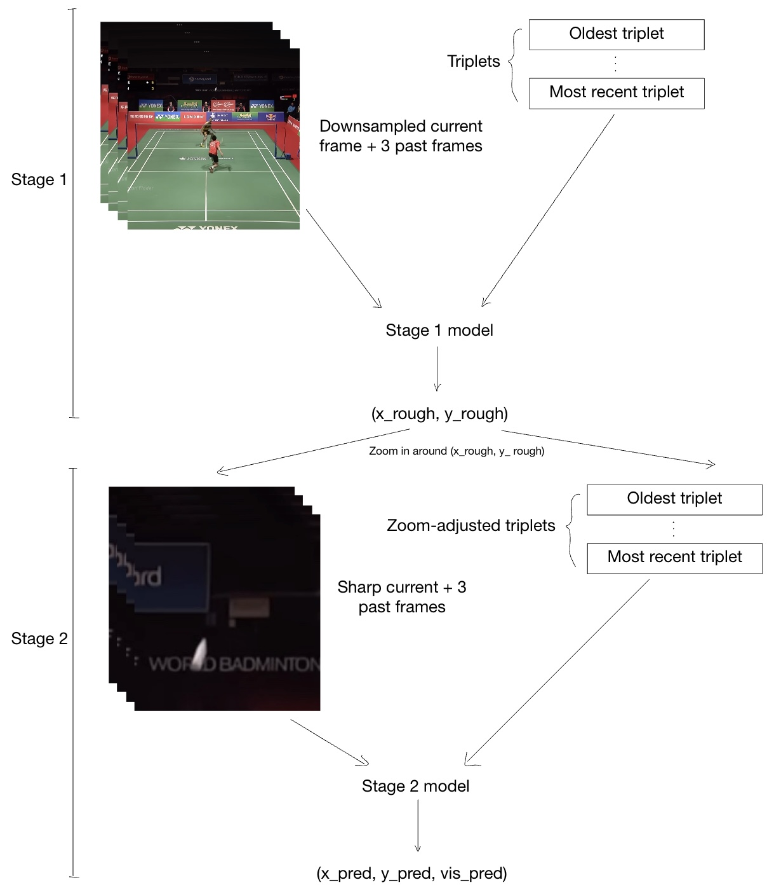
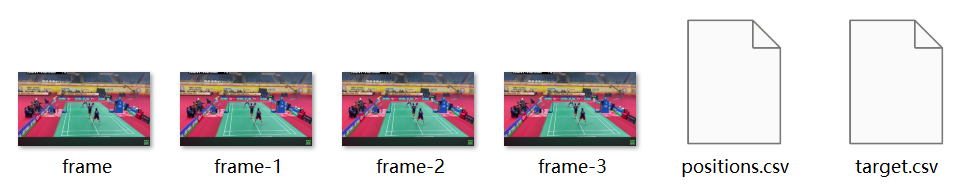
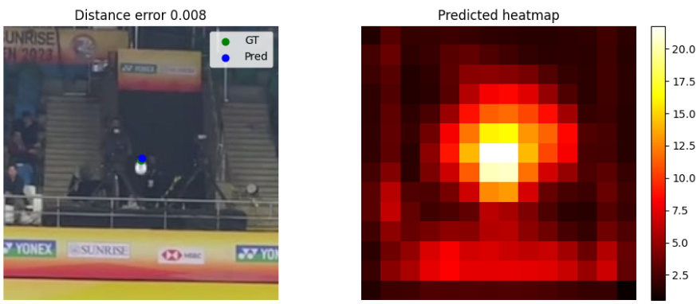
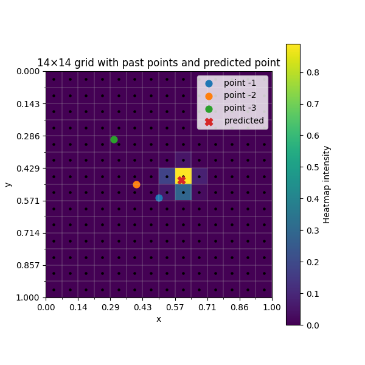

# 3. Technical Design

## Pipeline overview

In spite of having 11 versioned models (4 for stage 1, 7 for stage 2) with different
architectures, the general pipeline since the inception of this project has remained constant. 

Rather than presenting 
the pipeline as a fixed sequence, I describe the underlying challenges it was designed to solve. The pipeline’s 
structure will fall out naturally as a response to these problems.

---

### Problem 1: high-resolution requirements under real-time constraints

Most popular CNNs like ResNet, AlexNet, YOLOv8 and EfficientNet are capped off at an input resolution of 600x600, 
which is nowhere near the resolution we need (1920x1080). As we have stated, badminton shuttles typically occupy a 
height and width 1/30 of the frame, and thus become a blurred blob with any significant downsampling.

On top of this, we want to achieve inference speeds above 60 FPS, and 
since FLOPs scale quadratically with resolution, resolutions above 360x360 are not seriously considered. 

On the one hand, we need high resolution to pinpoint the shuttle head, but low resolution to meet runtime constraints.

**Impact on pipeline:**

This is only a problem if we insist on solving the problem statement with one CNN pass per frame. Thus, we must 
look to a multi-stage pipeline. Here, we are lucky because while locating the precise position of a 
shuttle head at low resolution is impossible (for someone with 10+ years of experience), finding the approximate region 
of the shuttle is not. Conceptually, we could look for a white blob or infer from the players’ movements.

Thus, we split the inference into two stages; stage 1 for locating the approximate region of the shuttle using frames 
downsampled to low resolution, and stage 2 for precisely locating the shuttle head once we zoom in around the rough 
prediction (by zooming in, we mean taking a low-resolution but sharp crop around the stage 1 prediction). We thus have 
a course-to-fine point estimation pipeline.

This coarse-to-fine pipeline not only satisfies our resolution-FPS requirements but also decouples training, with each 
stage having its own loss functions, optimizers etc. It also allows us to intelligently combine models from the two 
stages later to increase inference stability (discussed under Modes of inference).

---

### Problem 2: the need for context

While I was labeling shuttle heads, I would often find them too blurry to localize based on one frame alone. In those 
cases, I would roll back a few frames, find one in which the shuttle was clearer, and infer from the “good” frame where 
the shuttle head in the current frame should be. Since shuttle heads follow a smooth 
trajectory outside of being hit and do not change orientation much between frames, we can accurately infer from 
past data.

**Impact on pipeline:**

Both stages are fed the current frame, 3 prior frames and a sequence of triplets with structure 
(x, y, visibility) from the immediate past. For convention, these temporal inputs are ordered oldest to most recent. 

Together, this gives a context-enriched, coarse-to-fine pipeline that leverage the task's physical properties I learned 
while labeling. Figure 1 illustrates the inference pipeline.

<figure markdown>
  { width="80%" }
  <figcaption>Figure 1: Conceptual diagram of the inference pipeline</figcaption>
</figure>

---

## Dataset overview

To build a training set that reflects real-world gameplay, I collected footage from four 1920×1080, 60 FPS badminton 
videos: three were Creative Commons–licensed from YouTube, and one was personally recorded. My mum and I manually 
annotated 5,800 samples. After shuffling, 90% of samples were labeled as training, 5% were labeled validation and 
testing each. The structure of each sample is given in Figure 2.

<figure markdown>
  { width="80%" }
  <figcaption>Figure 2: Structure of each sample in the dataset</figcaption>
</figure>

frame is the current frame, the other three are the 3 past frames, with frame-1 being the most recent. positions.csv 
contains 30 past triplets, with (x_truth, y_truth, 1) if the shuttle head is present in its corresponding frame and 
(0, 0, 0) otherwise. Lastly, target.csv records the ground truth triplet for the current frame and is used in all loss 
functions. Figure 3 gives a conceptual overview of the process from raw mp4 to the samples.

<figure markdown>
  { width="80%" }
  <figcaption>Figure 3: process from mp4 -> samples</figcaption>
</figure>

---

### Data augmentation

To maximize robustness across lighting conditions, noise profiles, and camera angles, I implemented a selected set of 
augmentation techniques, ensuring realism was preserved while still enabling generalization.

**1. Uniform color jitter across frames**

Enhances the models' adaptability to various lighting conditions by changing brightness, contrast, saturation, 
and hue uniform across the 4-frame context.

```python
# dataset.py
self.color_jitter = torchvision.transforms.ColorJitter(
    brightness=0.3, contrast=0.2,
    saturation=0.2, hue=0.05
)
```

**2. Independent Gaussian noise per frame**

Prevents overfitting to low-level pixel patterns and encourages focus on higher-level motion and shapes.

```python
# dataset.py
def apply_noise(frames, noise_std=0.01):
    """
    Apply different Gaussian noise per frame.
    Takes in a list of images and returns a list of tensors.
    """
    noisy_frames = []
    for img in frames:
        img_tensor = transforms.ToTensor()(img)
        noise_std = np.random.uniform(low=0, high=noise_std)
        noise = torch.randn_like(img_tensor) * noise_std
        img_tensor = torch.clamp(img_tensor + noise, 0, 1)
        noisy_frames.append(img_tensor)
    return noisy_frames
```

**3. Horizontal flipping with positional adjustment**

Simulates mirrored camera angles with appropriate x-coordinate inversions.

```python
# dataset.py
if self.apply_flip and random.random() < 0.5:
    current_tensor = torch.flip(current_tensor, dims=[2])
    past_tensor = torch.flip(past_tensor, dims=[3])
    positions_tensor[:, 0] = 1.0 - positions_tensor[:, 0]
    target_tensor[0] = 1.0 - target_tensor[0]
```

**4. Triplet Perturbation**

Perturbs past (x, y) triplets slightly to discourage over-reliance on historical positional certainty, since inference
would not be as perfect.

```python
# dataset.py
def perturb_positions(positions, max_perturb=0.02):
    """
    Perturbs visible (x, y) positions in a list or NumPy array.
    Args:
        positions: list of [x, y, vis] or NumPy array of shape [T, 3]
        max_perturb: max change in normalized coords (±)
    Returns:
        np.ndarray of shape [T, 3] with perturbed positions
    """
    positions = np.array(positions, dtype=np.float32).copy()
    for i in range(len(positions)):
        x, y, vis = positions[i]
        if vis >= 0.5:
            dx = np.random.uniform(-max_perturb, max_perturb)
            dy = np.random.uniform(-max_perturb, max_perturb)
            new_x = np.clip(x + dx, 0.0, 1.0)
            new_y = np.clip(y + dy, 0.0, 1.0)
            positions[i][0] = new_x
            positions[i][1] = new_y
            # visibility stays unchanged

    return positions
```

**Reflections on Data Design Choices**

Some transformations such as affine warps and perspective distortions were intentionally excluded to preserve physical 
realism. However, in hindsight, random rescaling would have added resilience to changes in video scale, something the 
current models remain sensitive to (see [Limitations](results_mkdocs.md#limitations)).

---

## Key design decisions

**Stage-1 CNN backbones:** stage-1 models used either EfficientNet B3 or EfficientNetv2 B3 as their CNN backbones. 
The input size for both is 300 x 300, hence we must downsample all 4 frames before extracting feature maps. 
I picked the B3 version for both as it strikes a good balance between input resolution and FLOPs.

**Stage-2 CNN backbones:** stage 2 uses either EfficientNet B0 or EfficientNetV2 B0, both with input dimensions of 
224×224. This defines the precise crop size taken from the original frame, centered around the Stage 1 estimate.

B0 was chosen for its very low FLOPs, aligning with our goal of high FPS inference. However, the small crop size means 
the tolerance for stage-1 error is limited; only ±112 pixels in each direction. This makes accurate coarse localization 
in stage 1 especially critical.

**Heatmap paradigm:** In later versions of both stages (see [Model Development Log](model_development_log_mkdocs.md)), all models use heatmap-based 
localization rather than regressing coordinates directly with an MLP.

<figure markdown>
  { width="80%" }
  <figcaption>Figure 4: Demonstration of the heatmap approach</figcaption>
</figure>

On the left of Figure 4, we have a sharp crop of the current frame fed into a trained stage-2 model. The model slices 
the crop into a 14 x 14 grid. 

For each cell in the grid, the model looks at that cell in the current and past 
3 crops and outputs a single real number representing how likely it thinks that cell contains the shuttle head. 
Applying softmax gives a probability distribution, which we average to get a prediction, which in this case is very close 
to the ground truth (GT). 

**Interpolation physics model:**  for stage 2, past triplets contribute to the overall heatmap through a simple 
interpolation model: take 3 triplets in the past and perform a quadratic interpolation on the xy-coordinates to predict 
the xy-coordinates of the current triplet.

As shown in Figure 5, this generates a heatmap of its own, which we can add 
to the CNN-heatmap to influence the final prediction. A quadratic interpolation was picked as it is robust to 
overfitting and can be expressed neatly in closed form, given below.

```python
# auxiliary_heatmap.py
x_pred = x_1 - 3*x_2 + 3*x_3 #  x_1 represents the x-coordinate of the last triplet
y_pred = y_1 - 3*y_2 + 3*y_3
```

<figure markdown>
  { width="80%" }
  <figcaption>Figure 5: Example of heatmap generated by quadratic interpolation</figcaption>
</figure>

---

## Modes of inference

This subsection should belong under _Key design decisions_, but is promoted to section status due to its complexity.

At inference time, we choose between two distinct single-frame inference steps, each offering different trade-offs 
between accuracy and computational cost.

---

**Calibration step** closely resembles the inference pipeline described in Figure 1, with two key modifications:

- We employ an ensemble of two stage-2 models (a main model and a supporting model) to jointly predict the shuttle 
  head’s visibility. This ensemble approach improves visibility prediction accuracy at the cost of 
  doubling stage-2 compute. However, visibility prediction remains challenging and is prioritized for further updates.
- Instead of zooming in directly on the rough estimate (x_rough, y_rough), we construct an equilateral triangle of 
  circumradius 0.06 centered at that point and apply zooming at its three vertices. This strategy increases the stage-2 
  catchment area substantially, though it triples the computational cost.

As a result, we obtain six prediction triplets from stage 2: three spatial zooms from the triangle, each processed by 
two models. We then select the pair with the highest visibility score, and use the 
triplet predicted by the main stage-2 model as the final output.

In summary, running a calibration step on a frame invokes 4 passes through B3 (current + 3 past) and 24 passes through 
B0, taking roughly 20 GFLOPs including other non-backbone procedures. Its large catchment area with heavy computational 
cost gives it the name calibration.

**Fast step** bypasses both stage-1 and triangle construction, zooming in directly on the coordinates predicted 
in the previous frame. If the previous triplet is (0, 0, 0), we skip the current frame entirely and return (0, 0, 0). 

Skipping stage 1 is justified since the shuttle head typically remains visible in the crop centered around its prior 
position. For visibility prediction, fast step still uses two stage-2 models for ensemble voting.

In summary, running a fast step on a frame invokes only 8 passes through B0, taking roughly 4 GFLOPs; this is 
significantly cheaper than the calibration step, hence its name.

---

Modes of inference answer the question “which step should we use for the current frame”? We introduce 
**calibration mode**, **fast mode** and **smart mode**.

### Calibration mode

Runs a calibration step every single frame. Very slow and surprisingly unstable (the predictions tend to jump around); 
serves more as a benchmark than a practical inference method.

### Fast mode

Runs a calibration step once every `self.fast_calib_interval` frames, where `self.fast_calib_interval` is configurable. Every other frame is processed with fast steps. This mode produces more stable predictions than calibration mode, and is naturally much faster.

```python
# engine.py
elif self.mode == "fast":
    # Calibrate every K frames regardless
    if (self._t % self.fast_calib_interval) == 0:
        gx, gy, gv = self._calibration_step(cur_full, pos30)
        self._roll_past(cur_full)
        self._t += 1
        return gx, gy, gv, False
    else:
        # Use last if visible; else calibration
        if int(positions_deque[-1][2]) == 1:
            last_xy = (float(positions_deque[-1][0]), float(positions_deque[-1][1]))
            gx, gy, gv = self._fast_step(last_xy, cur_full, pos30)
        else:
            gx, gy, gv = (0, 0, 0)
```

---

### Smart mode

The smart mode of inference was developed around the philosophy of running calibration steps only when we detect 
pathological behaviors. Below, we outline the problems smart mode is designed to detect, the triggers for each, 
and the corresponding mitigation strategies.

**Problem 1: false negatives from missed shuttle visibility**

One problem with fast mode is that if any step predicts “invisible shuttle head”, we would have a sequence of 
“invisible shuttle head” predictions until the next calibration step. In the worst case, we must wait 
`self.fast_calib_interval` frames before the next calibration; potentially a lot of false negatives.

**Solution 1A: detect newly invisible predictions**

If the previous prediction was visible, but the current fast prediction is invisible, smart mode triggers a calibration 
step to verify whether the shuttle head is truly missing.

```python
# engine.py
p3x, p3y, p3v = self._fast_step(last_xy, cur_full, pos30)
last_two = self._last_two(positions_deque)
# if last_two is not None:
(x1, y1, v1), (x2, y2, v2) = last_two  # p1, p2
v1 = int(v1); v2 = int(v2)
# trigger 4: p2 (last prediction) visible but p3 invisible
if v2 == 1 and p3v == 0:
    self.freshly_invisible += 1
    gx, gy, gv = self._calibration_step(cur_full, pos30)
```

**Solution 1B: cap the maximum consecutive invisibility tolerated**

On top of this, we define `self.inv_len` as the number of consecutive “invisible shuttle head” predictions tolerated 
before triggering a calibration step.

```python
# engine.py
# (1) N consecutive invisibles?
if self._last_n_invisible(positions_deque, self.inv_len) \
    and (self._t - self._last_n_invisible_trigger_frame) >= self.inv_len:
    gx, gy, gv = self._calibration_step(cur_full, pos30)
    self._last_n_invisible_trigger_frame = self._t
```

The logic above also ensures that if, for example, `self.inv_len = 8`, the calibration check is performed at most once 
every 8 frames—even if the consecutive invisible condition continues to be met. Without this safeguard, the system 
would naïvely re-check every subsequent frame after the 8th, leading to redundant calibration attempts.

---

**Problem 2: false positives from background artifacts**

Due to visibility prediction being particularly challenging, it is frequently the case in both calibration and fast 
modes that we get a sequence of “visible shuttle head” predictions in the background or over players’ shirts. 
In egregious cases, the false positive predictions flit across the screen at a speed impossible for real shuttle heads.

**Solution 2A: large angular deviations**

It was observed that these false positives do not follow a smooth trajectory and are characterized by large angles 
between consecutive predictions. Thus, we define a configurable variable `self.angle_thresh` such that if the coordinates 
of three consecutive visible predictions form an angle larger than `self.angle_thresh`, then we trigger a calibration 
step.

**Solution 2B: large positional jumps**

Similarly, if the Euclidean distance between the last prediction and the current fast prediction exceeds `jump_thresh`, 
we trigger a calibration step.

```python
# engine.py
p3x, p3y, p3v = self._fast_step(last_xy, cur_full, pos30)
last_two = self._last_two(positions_deque)
# if last_two is not None:
(x1, y1, v1), (x2, y2, v2) = last_two  # p1, p2
v1 = int(v1); v2 = int(v2)

if v2 == 1 and p3v == 1:
    d2 = np.array([p3x - x2, p3y - y2], dtype=np.float32)
    # trigger 3: jump too large
    jump = float(np.linalg.norm(d2))
    if jump >= self.jump_thresh:
        self.big_jump += 1
        gx, gy, gv = self._calibration_step(cur_full, pos30)
        return gx, gy, gv, True
    # triggers 2 when p1 and p2 are visible, and we got a visible p3
    if v1 == 1:
        d1 = np.array([x2 - x1, y2 - y1], dtype=np.float32)
        # trigger 2: angle between d1 and d2 too large
        ang = self._angle_between(d1, d2)
        if ang >= self.angle_thresh:
            self.big_angle += 1
            gx, gy, gv = self._calibration_step(cur_full, pos30)
            return gx, gy, gv, True
```

---

**Problem 3: frequent calibration triggers indicate model uncertainty**

So far, if we detect unstable behavior during a fast step, we 
would replace the fast step prediction with one from calibration step. However, calibration step is not error-proof 
and during inference, we have no way of knowing if the prediction returned from the calibration step is correct.

**Solution 3: penalize frequent calibrations with triplet zeroing**

A heuristic we use is that triggering a calibration step implies unstable inference. Thus, if we trigger 
calibration steps frequently during a short time window, then we can be confident that some instability is plaguing 
inference e.g. a player’s white shirt suddenly catching bright glints, giving patches that resemble shuttles. 

To 
penalize triggering many calibrations within a short time window, we define a buffer `calib_window` which records the 
number of calibrations within the last 6 frames. If at any time, that number exceeds 4, then we replace the last 6 
triplets with (0, 0, 0) to eliminate the noisy output.

```python
# video_inferencer.py
if sum(calib_window) >= 4:
    n = len(calib_window)
    for i in range(n):
        positions_deque[-(i + 1)] = [0.0, 0.0, 0]
        f, _, _, _ = out_window[-(i + 1)]
        out_window[-(i + 1)] = (f, 0.0, 0.0, 0)
    gx, gy, gv = 0.0, 0.0, 0
    calib_window.clear()
```

---

One might say that these artificial safeguards are a sign of weak models; in the case of visibility prediction, that is 
admittedly true. However, setting aside the visibility issue, the safeguards simply inform the pipeline what we know 
about shuttle physics. 

Moreover, when a human is annotating the frames in the first place, they are implicitly applying these checks e.g. 
“this blob really looks like a shuttle, but it’s miles away from where I last confidently predicted the shuttle head, 
so it’s probably just background noise”.

In practice, smart mode averages at 86 FPS and is much more stable than fast mode, making it the recommended mode of 
inference.

<br><br>