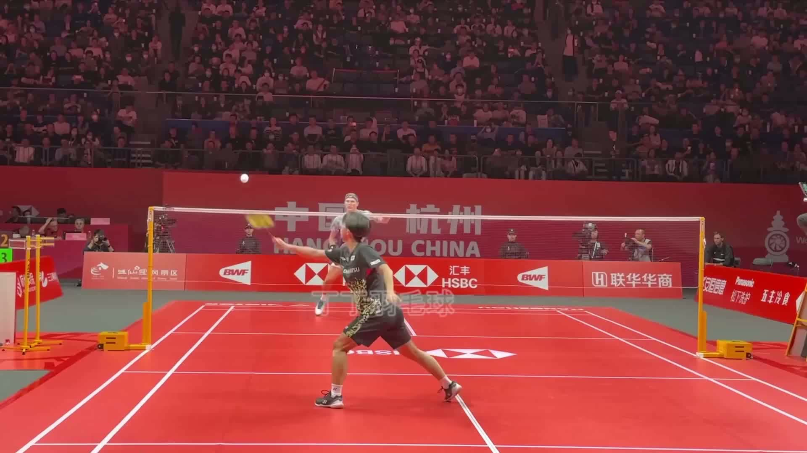
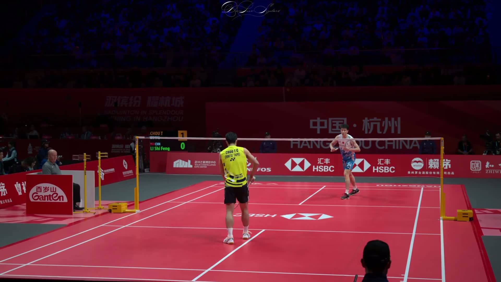

# Shuttle Detection Videos

Below are 5 unseen snippets labeled by our inference pipeline. Click to play.

  <a href="../labeled_videos/1.mp4">
    
    Watch Snippet 1
  </a>

  <a href="../labeled_videos/2.mp4">
    
    Watch Snippet 2
  </a>

  <a href="../labeled_videos/3.mp4">
    
    Watch Snippet 3
  </a>

  <a href="../labeled_videos/4.mp4">
    
    Watch Snippet 4
  </a>

  <a href="../labeled_videos/5.mp4">
    
    Watch Snippet 5
  </a>

